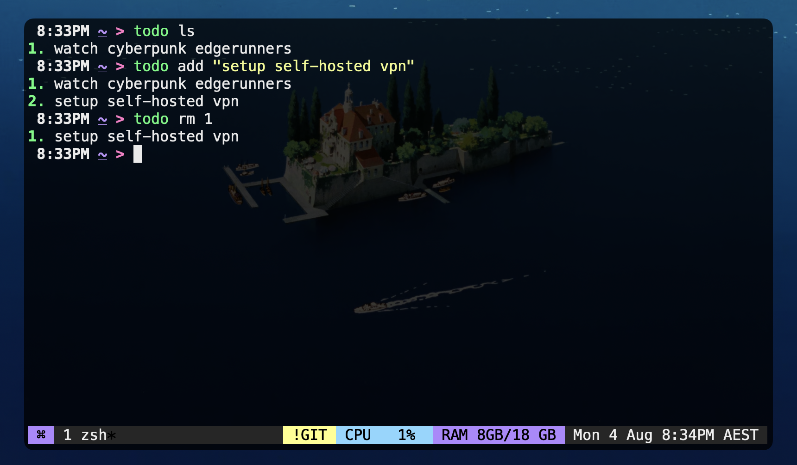

# Todo

Simple todo CLI written in Go.\
`$ todo -h` for help.



## Installation
1. Clone the repository.
2. `go install main.go`

## Usage
1. Add a todo.
```
$ todo add "buy strawberries"
$ todo add "buy bananas"
```
2. List all todos.
```
$ todo ls
1. buy strawberries
2. buy bananas
```
3. Mark a todo as done.
```
$ todo rm 1
1. buy bananas
```

## Storage
Todos are stored in a file named `todo.txt` in the home directory.\
