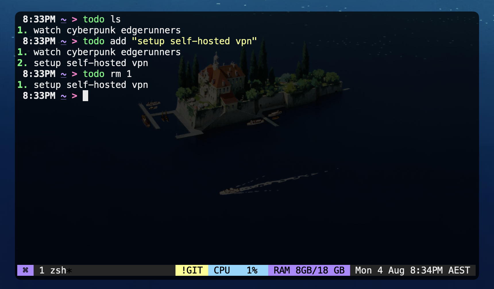

# Todo

Simple todo CLI written in Go.\
`$ todo -h` for help.



## Installation
1. Clone the repository.
2. Install with `just install`.

Run `just` to see the available project commands.

## Usage
1. Add a todo.
```
$ todo add "buy strawberries"
$ todo add "buy bananas"
```
2. List all todos.
```
$ todo ls
1. buy strawberries
2. buy bananas
```
3. Mark a todo as done.
```
$ todo done 1
1. buy bananas
```

## Storage
Todos are stored in a file named `.todos.txt` in the home directory.

## Tests
Run tests with `just test`.
Code coverage with `just coverage`.
Then visualize with `just visualise` and open `coverage.html` in browser.

## Development
Build the CLI with `just build`.
Remove the local build artifact with `just clean`.
